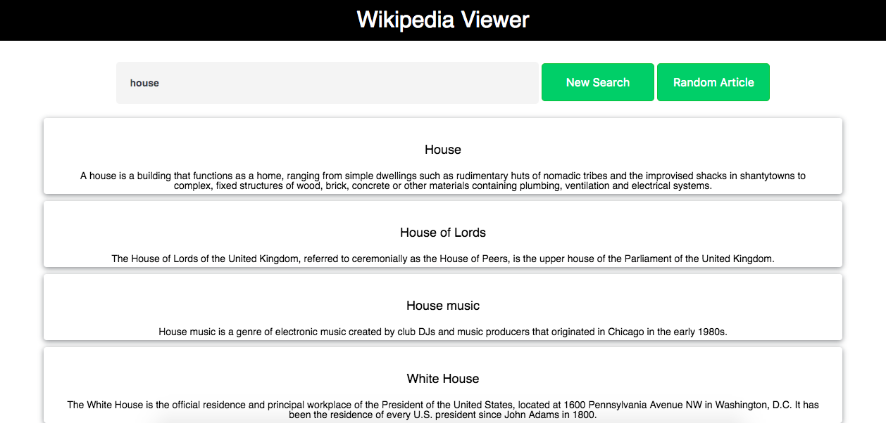

# WikipediaViewer
Wikipedia Viewer developed by me as Free Code Camp #3 Intermediate Front End Development Projects

<ol>
  <li>Objective: Build a CodePen.io app that is functionally similar to this: https://codepen.io/FreeCodeCamp/full/wGqEga/.</li>
  <li>Rule #1: Don't look at the example project's code. Figure it out for yourself.</li>
  <li>Rule #2: Fulfill the below user stories. Use whichever libraries or APIs you need. Give it your own personal style.</li>
  <li>User Story: I can search Wikipedia entries in a search box and see the resulting Wikipedia entries.</li>
  <li>User Story: I can click a button to see a random Wikipedia entry.</li>
  <li>Hint #1: Here's a URL you can use to get a random Wikipedia article: https://en.wikipedia.org/wiki/Special:Random.</li>
  <li>Hint #2: Here's an entry on using Wikipedia's API: https://www.mediawiki.org/wiki/API:Main_page.</li>
  <li>Hint #3: Use this link to experiment with Wikipedia's API.</li>
  <li>Remember to use Read-Search-Ask if you get stuck.</li>
  <li>When you are finished, click the "I've completed this challenge" button and include a link to your CodePen.</li>
  <li>You can get feedback on your project by sharing it with your friends on Facebook.</li>
</ol>

